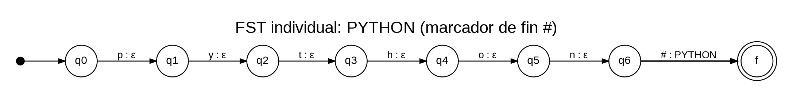
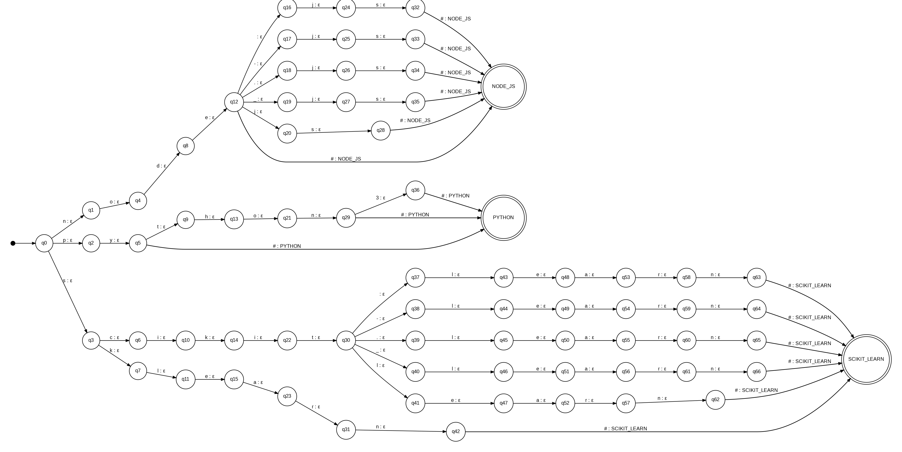

# Stage 2 — Revised Formal Design of the Normalization Transducer

## 1. Purpose and Scope

Stage 2 receives each token from `ExtractedData.skills_raw`, applies `normalize_text()`, and transforms it into a canonical name if it appears in the catalog. Tokens that are not recognized are stored in `unrecognized`. Normalization is global and independent of the profile; sorting by category and profile occurs later.

## 2. Catalog and Pre-normalization

Let `C` be the catalog loaded by `Catalog.from_json()` and let `S = Catalog.spellings()`, a map of normalized forms to canonical names. The keys of `S` are obtained by combining the aliases from `catalog.json` with the variants generated by `name_variants(canonical)`. Before the FST, `normalize_text()` applies NFKC, `casefold()`, and whitespace collapsing. It does not remove internal punctuation.

The input to the FST is a single normalized form followed by a special end marker `#`. The marker is conceptually appended by the normalizer after preparing the token; it is not part of the catalog aliases. It is reserved to signal that the token has ended.

## 3. Alphabets

- `Σ`: characters appearing in the keys of `S`, plus the end marker `#`.
- `Γ`: set of canonical names present in `C`. Each complete canonical name, for example `SCIKIT_LEARN`, is treated as a single output symbol.
- `ε`: empty output on a transition that consumes characters of the form without emitting the canonical name yet.

## 4. Deterministic Construction via Prefixes

A shared trie of all keys in `S` is constructed. Each state represents a prefix of at least one recognized form; the initial state represents the empty prefix `ε`. For each prefix `p` and character `a`, there exists at most one transition `p --a:ε--> pa` if `pa` is also a prefix of some form in the catalog.

When a state represents a complete form `s` and `S(s)=c`, a transition `s --#:c--> f_c` is added, where `f_c` is a final state associated with the canonical name `c`. **The canonical name is only emitted when consuming `#`**, not when consuming the last letter of the form. This allows a complete form to be a prefix of another form belonging to a different canonical name, without prematurely emitting an output.

The token is accepted only if the path consumes the entire normalized form and the marker `#`, ending in a final state. If any required transition does not exist, the form is not recognized and Stage 2 adds it to `unrecognized`.

### Determinism and Functionality

The construction is deterministic because the trie has a unique path for each character sequence and `#` is reserved as an end marker, distinct from the characters of the normalized forms. Each complete form has a single value in `S`, since `Catalog` rejects the same normalized form assigned to two different canonical names. Therefore, each accepted token produces exactly one canonical symbol.

The design assumes that `#` does not appear in any normalized form in the catalog. If the catalog is expanded, this condition must be explicitly validated.

## 5. Formal Seven-Tuple

We use the slide convention: `T = (Q, Σ, Γ, δ, ω, q0, F)`, where `Q` is the set of states, `Σ` is the input alphabet, `Γ` is the output alphabet, `δ` is the state transition function, `ω` is the output function, `q0` is the initial state, and `F` is the set of final states.

For a canonical qualification `c`, let `L_c = {s | S(s)=c}`. The individual transducer is defined as follows:

- `Q`: all prefixes of the forms in `L_c`, plus the final state `f_c`.
- `Σ`: characters of the forms in `L_c`, plus `#`.
- `Γ`: canonical names of the catalog; this transducer only emits `c`.
- `δ(p,a)=pa` when `pa` is a prefix of some form in `L_c`; additionally, `δ(s,#)=f_c` for each `s ∈ L_c`.
- `ω(p,a)=ε` for character transitions; `ω(s,#)=c` for each `s ∈ L_c`.
- `q0=ε`, the empty prefix state.
- `F={f_c}`.

### Example A — `PYTHON`

According to the shared catalog, `L_PYTHON = {python, py, python3}`. The traversal of `python#` consumes the letters `p`, `y`, `t`, `h`, `o`, `n` with output `ε` at each transition and then consumes `#`, emitting `PYTHON` to the final state. The form `py` also terminates correctly because its `#` marker emits `PYTHON`; if the input continues with `t`, the path can proceed towards `python`.

### Example B — `NODE_JS`

Relevant normalized forms include `node`, `nodejs`, `node.js`, `node js`, `node-js`, and `node_js`. They share the prefix `node`; each variant is distinguished by what follows or by the `#` marker. In all cases, the output is emitted only upon reading `#` and is `NODE_JS`.

### Example C — `SCIKIT_LEARN`

Forms include `sklearn`, `scikit-learn`, `scikit learn`, `scikit.learn`, `scikitlearn`, and `scikit_learn`. Transitions reading the characters emit `ε`; upon reading `#` at the end of a recognized form, the transducer emits `SCIKIT_LEARN`.

## 6. Global Union

The global union is not drawn as a collection of disconnected paths. A single shared trie is constructed using all keys of `S`. When a complete form corresponds to the canonical name `c`, its complete form state has a transition via `#` to `f_c` with output `c`. Common prefixes are shared, so there is at most one transition per state and input symbol.

The attached union diagram is **reduced and illustrative**: it shows the catalog forms for `PYTHON`, `NODE_JS`, and `SCIKIT_LEARN`, not all 38 qualifications. The actual global transducer must be generated by traversing `Catalog.spellings()`.

## 7. Important Clarification

- The constructor also verifies this condition when loading the catalog.
- There are forms that are prefixes of other forms associated with different canonical names (e.g., `py` / `pytorch`, `git` / `github actions`). This does not invalidate the catalog, but it does make it necessary to defer the output until the end marker `#`.

## 9. Diagrams

Individual transducer of `PYTHON` with output at the `#` marker.

It demonstrates how a finite-state transducer works for a single qualification. The system reads the word "python" character by character without generating output during the reading process. Upon receiving the marker #, which indicates the end of the input, it outputs the canonical name PYTHON. This illustrates how a textual representation is transformed into a standardized form.

Reduced union trie for three canonical names. It does not replace the complete diagram derived from the catalog.

It illustrates how multiple transducers can be combined into a common structure by sharing matching prefixes. It includes examples using Python, Node.js, and scikit-learn, along with some of their variants. The goal is to demonstrate how different spellings can be converted into their respective canonical names within a single system.

NOTE: `ε` indicates empty output; `# : CANONICAL` indicates that the canonical name is emitted when the token ends.