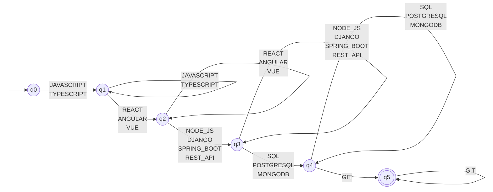

# Recognition stage

## Full Stack Developer Automaton

### Input assumption

The input is the sequence produced by the ordering stage for the Full Stack profile: only the qualifications marked FS in the catalog, sorted by the Full Stack canonical order (`LANGUAGE → FRONTEND → BACKEND → DATABASE → VCS`). Qualifications that belong to other profiles are removed by the ordering stage and never reach the automaton.

### Pattern

A résumé satisfies the Full Stack Developer pattern when its ordered sequence contains at least one qualification from each of the five requirement groups below, in that order.

| Group | Category | Symbols (marked FS) |
|---|---|---|
| G1 | `LANGUAGE` | JAVASCRIPT, TYPESCRIPT |
| G2 | `FRONTEND` | REACT, ANGULAR, VUE |
| G3 | `BACKEND` | NODE_JS, DJANGO, SPRING_BOOT, REST_API |
| G4 | `DATABASE` | SQL, POSTGRESQL, MONGODB |
| G5 | `VCS` | GIT |

### Formal definition

$M_{FS} = (Q, \Sigma, \delta, q_0, F)$

- $Q = {q_0, q_1, q_2, q_3, q_4, q_5}$
  - $q_0$: no requirement met
  - $q_1$: a language found (G1)
  - $q_2$: a frontend framework found (G2)
  - $q_3$: a backend technology found (G3)
  - $q_4$: a database found (G4)
  - $q_5$: version control found (G5), all requirements met
- $\Sigma = G1 \cup G2 \cup G3 \cup G4 \cup G5$ (13 symbols: JAVASCRIPT, TYPESCRIPT, REACT, ANGULAR, VUE, NODE_JS, DJANGO, SPRING_BOOT, REST_API, SQL, POSTGRESQL, MONGODB, GIT)
- $\delta$, for $i = 1, 2, 3, 4, 5$ and every a in $G_i$:
  - advance: $\delta(q(i-1), a) = q_i$
  - stay: $\delta(q_i, a) = q_i$ (another alternative of the same group)
  - Every pair (state, symbol) not listed has no transition: it leads to an implicit non-accepting trap state, and the sequence is rejected.
- $q_0$ is the initial state.
- $F = {q_5}$.

$\delta$ has 26 transitions: 13 advance and 13 stay.

### Language recognized

$L(M_{FS}) = G1^+ G2^+ G3^+ G4^+ G5^+$

That is, one or more symbols of G1, followed by one or more of G2, then G3, G4 and G5, where each group admits any of its alternatives (for example JAVASCRIPT TYPESCRIPT REACT ...).

### Automaton type: DFA

1. There is a single initial state and no λ-transitions: every transition reads one symbol.
2. From each state, a symbol has at most one transition. From $q_i$, a symbol can belong to $G_i$ (stay) or to $G_{i+1}$ (advance), never both, because the groups are disjoint: every qualification in the catalog has exactly one category.

Nondeterminism is not needed: the ordering stage guarantees that, at each moment, only the current group or the next one can still be satisfied, and no group is optional.

### Transition diagram

Each arrow stands for one transition per listed symbol. Missing transitions lead to the implicit trap state.

### Examples

| Ordered sequence (after filtering) | Result | Final state |
|---|---|---|
| JAVASCRIPT, REACT, NODE_JS, POSTGRESQL, GIT | ACCEPTED | q5 |
| TYPESCRIPT, ANGULAR, DJANGO, MONGODB, GIT | ACCEPTED | q5 |
| JAVASCRIPT, TYPESCRIPT, REACT, NODE_JS, SQL, POSTGRESQL, GIT | ACCEPTED (stay transitions at q1 and q4) | q5 |
| JAVASCRIPT, REACT, POSTGRESQL, GIT | REJECTED (no backend: no transition from q2 on POSTGRESQL) | trap |
| JAVASCRIPT, REACT, NODE_JS, POSTGRESQL | REJECTED (no version control) | q4 |
| SQL, GIT (from PYTHON, PANDAS, SCIKIT_LEARN, SQL, GIT) | REJECTED (no G1 symbol: no transition from q0 on SQL) | trap |